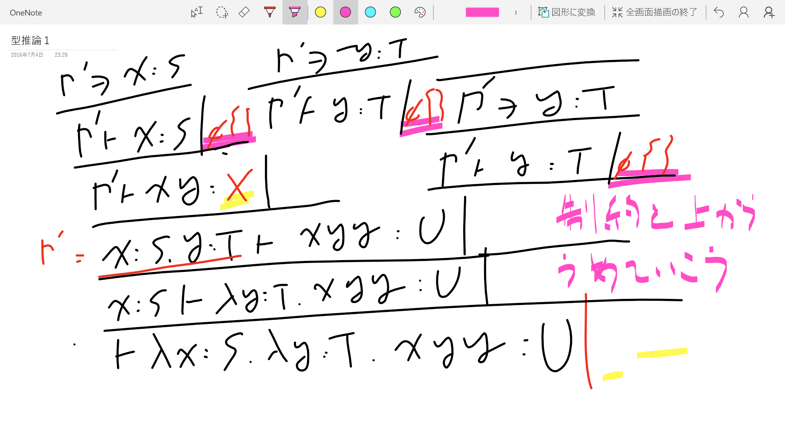

# 型推論器と現実

型の恩恵は欲しい、  
でも型は書きたくないって……おかしいですか？

人は型を書くために生きるのにあらず…

### 目次

OCamlの型推論アルゴリズムをみていくよ

- 基本的な型推論
- 副作用を入れたバージョン
- Level-Basedな型推論アルゴリズム
- コードリーディング

### 自己紹介

- インターネットの闇
- でもインターネットにつながらないサーバに苦しんでる


### TAPLにのってる実装

数学的なアプローチ

- Constraint Typingをやって制約を集めてくる
  
- HindleyとMilnerのUnificationアルゴリズムで制約を解く

### 実際にやってみよう





### 現実は厳しい

- このアルゴリズムめっちゃ遅い  
  - 現実のプログラムじゃ下から上に遡りたくなんてない
  - いちいち成約を集めて保持しておくなんて面倒ですよね？
- `X = Y`がわかった時に代入しちゃえばいいじゃん  
  - `min-caml`の実装とか
  - これ多相性ないけど残った型変数を多相型にしちゃえばいい

### 実装: unify

`min-caml`でやっていることの焼きまし簡略版だよ〜

``` ocaml
type t = Int | Arrow of t * t | Var of t option ref;;

let gentyp () = Var (ref None);;

exception Unify of t * t

let rec occur r = function
| Int -> false
| Arrow (t1, t2) -> occur r t1 || occur r t2
| Var r' when r == r' -> true
| Var {contents = None} -> false
| Var {contents = Some t} -> occur r t

let rec unify a b = match a, b with
| Int, Int -> ()
| Var s, Var t when s == t -> ()
| Arrow (s, t), Arrow (u, v) -> begin unify s u; unify t v end
| Var ({contents = None} as r), _  -> begin
    if occur r b then raise (Unify (a, b)) else
    r := Some b
end
| _, Var ({contents = None} as r) -> begin
    if occur r a then raise (Unify (a, b)) else
    r := Some b
  end
| Var ({contents = Some c}), _ -> unify c b
| _, Var ({contents = Some c}) -> unify a c
| _ -> raise (Unify (a, b))

(*
    utop[16]> let t = gentyp ();;
    val t : t = Var {contents = None}
    utop[17]> unify t (Arrow (gentyp (), Int));;
    - : unit = ()
    utop[18]> t;;
    - : t = Var {contents = Some (Arrow (Var {contents = None}, Int))}
    utop[19]> unify t (Arrow (Int, Int));;
    - : unit = ()
    utop[20]> t;;
    - : t = Var {contents = Some (Arrow (Var {contents = Some Int}, Int))}
*)
```

### 実装: プログラミング言語に型付け

let式、int型の定数、変数、足し算、匿名関数、関数適用しかない言語

``` ocaml
(* 言語の定義 *)
type term =
| Const of int | Plus of term * term
| Let of string * term * term | Var of string
| Fun of string * term
| App of term * term

(* let式の型付け *)
exception Typing of term

let rec follow = function
| Int -> Int
| Arrow _ as self -> self
| Var {contents = None} as self -> self
| Var {contents = Some t} -> follow t

let rec typing env t = match t with
  | Const _ -> Int
  | Plus (a, b) -> begin unify Int (typing env a); unify Int (typing env b); Int end
  | Let (v, s, t) -> typing ((v, typing env s) :: env) t
  | Fun (v, t) ->
    let arg = gentyp () in
    let ret = typing ((v, arg) :: env) t in
    Arrow (arg, ret)
  | Var s -> begin try List.assoc s env with Not_found -> raise (Typing t) end
  | App (a, b) -> begin
      let body_typ = typing env a in
      let arg_typ = typing env b in
      match body_typ with
      | Arrow (t1, t2) -> unify t2 arg_typ; t2
      | _ -> raise (Typing t)
    end
```

### min-camlの実装を読みましょう

- [type.ml](https://github.com/esumii/min-caml/blob/master/type.ml)
- [typing.ml](https://github.com/esumii/min-caml/blob/master/typing.ml)

### 多相性があると

型変数をgeneralizeする必要がある  
`let a = b in e`で、aの型付けが終わった時に制約がない型変数を  
generalizeしてforallをつける

``` ocaml
let f = fun (x:'a) -> x in
(f 1, f "SML")

```


### 問題

問題:  
関数がネストするときに、どの変数をgeneralizeしていいのか  
わからなくなる

``` ocaml
(* f : 'a -> 'a *)

let f (x:'a) = 
  let g (y:'b) = x in
  (* ここを抜けた時に'bはgeneralizeされるべきだけど
     'aはまだ。どうやって効率よくエンコードする？ *)
  g 12
```

### さて現実

- 現実のプログラミング言語にはもっと豊かな型が必要
  - レコード、タプルとか
  - オブジェクト
  - 第一級モジュール
  - GADT
  - `-rectypes`のrecursive types (!)

``` ocaml
[~/] ocaml -rectypes
        OCaml version 4.02.3
# let rec f x = f f;;`
val f : 'a -> 'b as 'a = <fun>
```

### 現実の実装

- [types.ml](http://github.com/ocaml/ocaml/blob/typing/types.mli)
- `wc -l *.ml *.mli`の合計が31208行、えぐい

### OCamlの実装を読むよ

- let式の型付けをまずは読む  
  - [typecore.ml](http://github.com/ocaml/ocaml/blob/typing/typecore.ml)
  - `begin_def`とかいう副作用を起こす不穏な関数  
    `level`とか不思議なものが出てきてるぞ？

### Level-basedな型推論アルゴリズム
  - Remmyさんが考えてOlegさんがドキュメント化している  
  [How OCaml type checker works -- or what polymorphism and garbage collection have in common](http://okmij.org/ftp/ML/generalization.html)  
    型変数のGeneralizationはコストがかかるからこれを高速化する  
  
### 原理

``` ocam
;; level = 0
let f (x:1) = ;; level = 1
  let g (y:2) : 2 -> 1 = ;; level = 2 
    x:1 in
  g x 
```

- `let x = e1 in e2`のe1の推論をし始める時にLevelを上げる
- `e2`の推論をし始める時にレベルを戻す

### あとはコードを読みます

- begin_def, end_def  
  Levelの上げ下げ
- mark_type, unmark_type  
  再帰しているかもしれない型の探索のために  
  サーチ済みの型のコンストラクタに印をつけるよ！Levelにな！！！！
- type_let  
  まともな部分も読んでみましょう
- type_expression  
  型付けの本体部分
